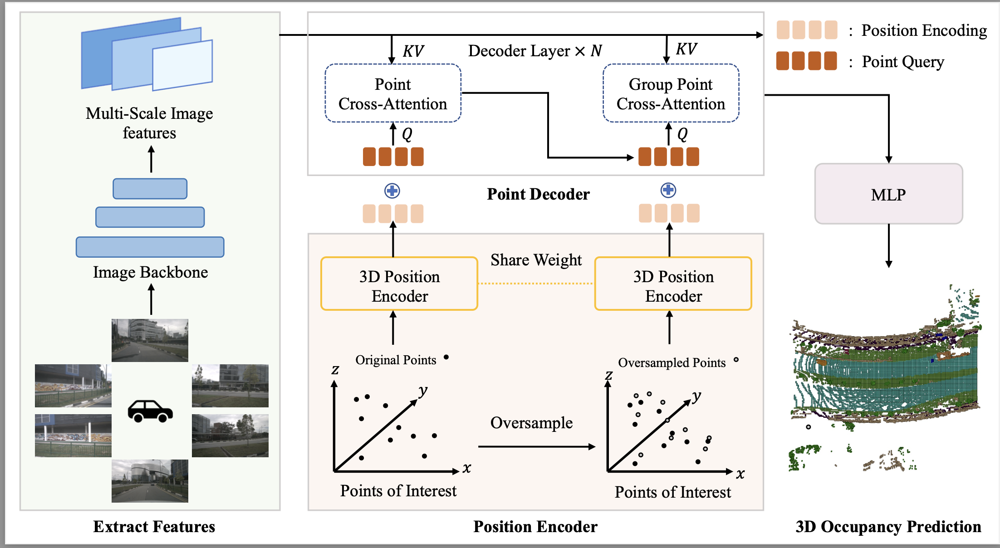

<div align="center">
<h1>Occupancy as Set of Points </h1>

[Yiang Shi](https://github.com/shawnsya)<sup>1,\*</sup>, [Tianheng Cheng](https://scholar.google.com/citations?user=PH8rJHYAAAAJ)<sup>1,\*</sup>, [Qian Zhang](https://scholar.google.com/citations?user=pCY-bikAAAAJ&hl=zh-CN)<sup>2</sup>, [Wenyu Liu](http://eic.hust.edu.cn/professor/liuwenyu/)<sup>1</sup>, [Xinggang Wang](https://xwcv.github.io/)<sup>1 :email:</sup>
 
<sup>1</sup>  [School of EIC, HUST](http://english.eic.hust.edu.cn/),
<sup>2</sup>  [Horizon Robotics](https://en.horizonrobotics.com/)


\* equal contribution, <sup>:email:</sup> corresponding author.

**ECCV 2024**

</div>


#

### News
* `[2024-7-2]` OSP is accepted by ECCV 2024!


## Abstract
In this paper, we explore a novel point representation for 3D occupancy prediction from multi-view images, which is named Occupancy as Set of Points. Existing camera-based methods tend to exploit dense volume-based representation to predict the occupancy of the whole scene, making it hard to focus on the 
special areas or areas out of the perception range. In comparison, we present the Points of Interest(PoIs) to represent the scene and propose OSP, a novel framework for point-based 3D occupancy prediction. Owing to the inherent flexibility of the point-based representation, OSP achieves state-of-the-art 
performance compared with existing methods and excels in terms of training and inference adaptability. It extends beyond traditional perception boundaries and can be seamlessly integrated with volume-based methods to significantly enhance their effectiveness. Experiments on the Occ3D-nuScenes occupancy 
benchmark show that OSP has strong performance and flexibility. 


<div align="center">

</div>

## Citations
```bibtex
```

