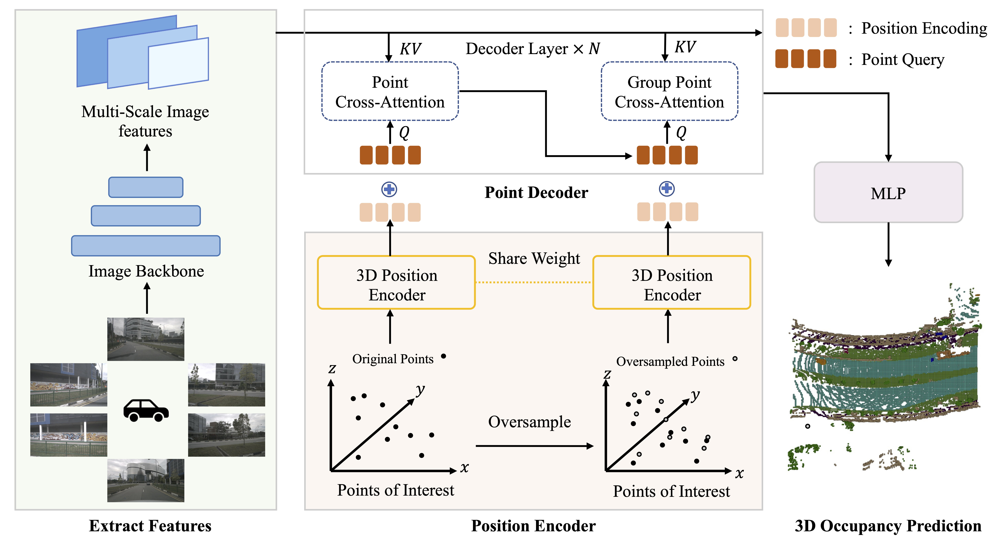

<div align="center">
<h1>Occupancy as Set of Points </h1>

[Yiang Shi](https://github.com/shawnsya)<sup>1,\*</sup>, [Tianheng Cheng](https://scholar.google.com/citations?user=PH8rJHYAAAAJ)<sup>1,\*</sup>, [Qian Zhang](https://scholar.google.com/citations?user=pCY-bikAAAAJ&hl=zh-CN)<sup>2</sup>, [Wenyu Liu](http://eic.hust.edu.cn/professor/liuwenyu/)<sup>1</sup>, [Xinggang Wang](https://xwcv.github.io/)<sup>1 :email:</sup>
 
<sup>1</sup>  [School of EIC, HUST](http://english.eic.hust.edu.cn/),
<sup>2</sup>  [Horizon Robotics](https://en.horizonrobotics.com/)


\* equal contribution, <sup>:email:</sup> corresponding author.

**ECCV 2024**

</div>


#

### News
* `[2024-7-8]` We have released the [arXiv paper](https://arxiv.org/abs/2407.04049) of OSP.
* `[2024-7-2]` OSP is accepted by ECCV 2024!


## Abstract
In this paper, we explore a novel point representation for 3D occupancy prediction from multi-view images, which is named Occupancy as Set of Points. Existing camera-based methods tend to exploit dense volume-based representation to predict the occupancy of the whole scene, making it hard to focus on the special areas or areas out of the perception range. In comparison, we present the \textit{Points of Interest} (PoIs) to represent the scene and propose OSP, a novel framework for point-based 3D occupancy prediction. Owing to the inherent flexibility of the point-based representation, OSP achieves strong performance compared with existing methods and excels in terms of training and inference adaptability. It extends beyond traditional perception boundaries and can be seamlessly integrated with volume-based methods to significantly enhance their effectiveness. Experiments on the Occ3D-nuScenes occupancy benchmark show that OSP has strong performance and flexibility.

<div align="center">

</div>

## Preliminary

### Installation
1. Prepare conda environment referring to the documentation of [BEVFormer](https://github.com/fundamentalvision/BEVFormer/blob/master/docs/install.md)

### Prepare Dataset
1. Download nuScenes and prepare annotations referring to the documentation of [3D Occupancy Prediction Challenge at CVPR 2023](https://github.com/CVPR2023-3D-Occupancy-Prediction/CVPR2023-3D-Occupancy-Prediction)

### Pretrained Weights 
The pretrained weight of fcos3d can be downloaded [here](https://github.com/zhiqi-li/storage/releases/download/v1.0/r101_dcn_fcos3d_pretrain.pth)


## Usage 
1. **Training**
    ```shell
    bash train.sh
    ```
    * Replace the default config file as needed.
    * Config osp_minibatch.py represents mini dataset of nuScenes. 


2. **Evaluation**
    ```shell
    bash test.sh
    ```
    * Replace the default config file as needed.
    * Replace the checkpoint path in the script with your own.

## Results
| Backbone | Method | Lr Schd | IoU|  Config | Download |
| :---: | :---: | :---: | :---: | :---: | :---: |
| R101 | OSP | 24ep | 39.41 |[config](projects/configs/osp/osp.py) |[model]()|
| R101 | BEVFormer w/ OSP | 24ep | 41.21 |[config](projects/configs/osp/osp.py) |[model]()|

* Model weights will be released later.

## Citations
```bibtex
@inproceedings{shi2024occupancysetpoints,
      title={Occupancy as Set of Points}, 
      author={Yiang Shi and Tianheng Cheng and Qian Zhang and Wenyu Liu and Xinggang Wang},
      year={2024},
      booktitle={ECCV}
}
```


## License

Released under the [MIT](LICENSE) License.
